# spring-gumball ci/cd example
## Screenshots of your "full" desktop for the Part 1 (CI) 
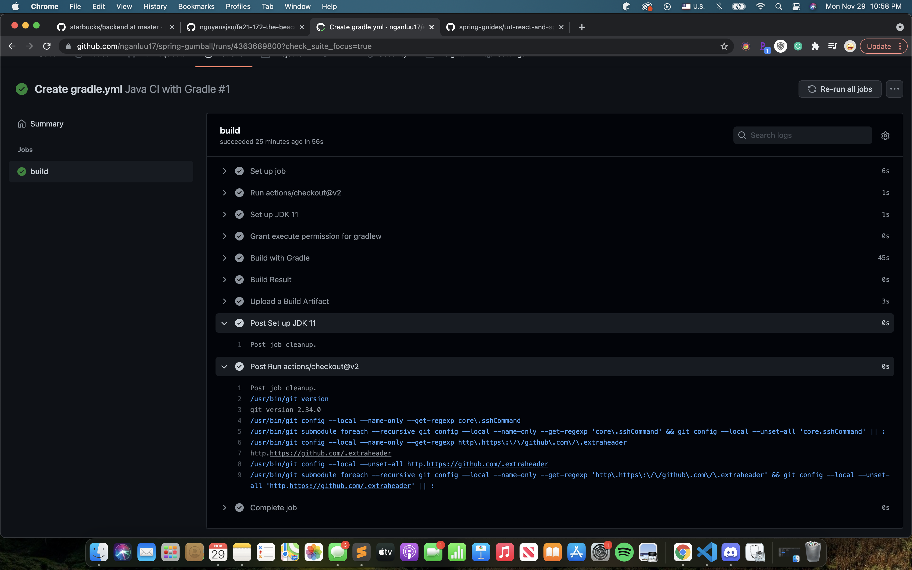

## Screenshots of your "full" desktop for the Part 2 (CD) 
### GCP Service Accoucnt & JSON Service Account Key
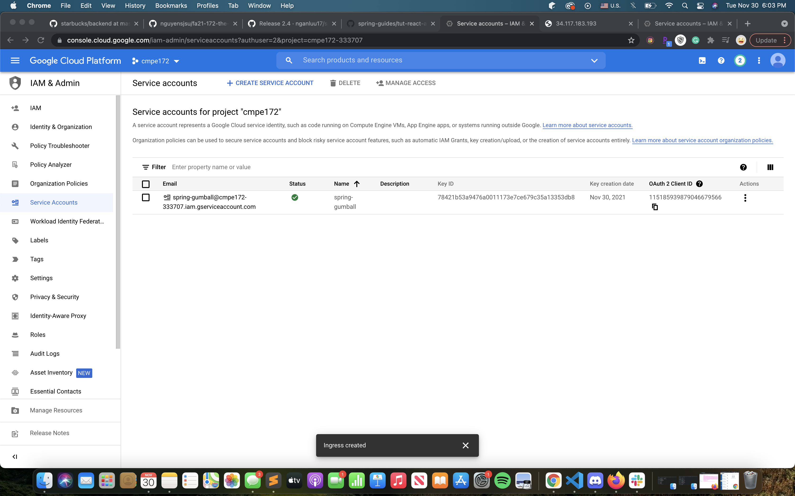
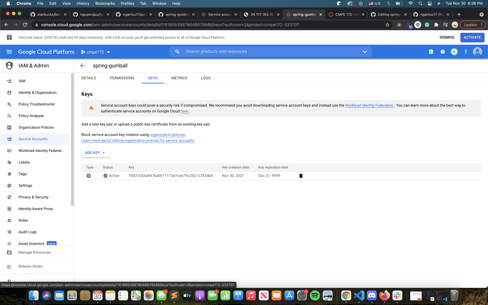
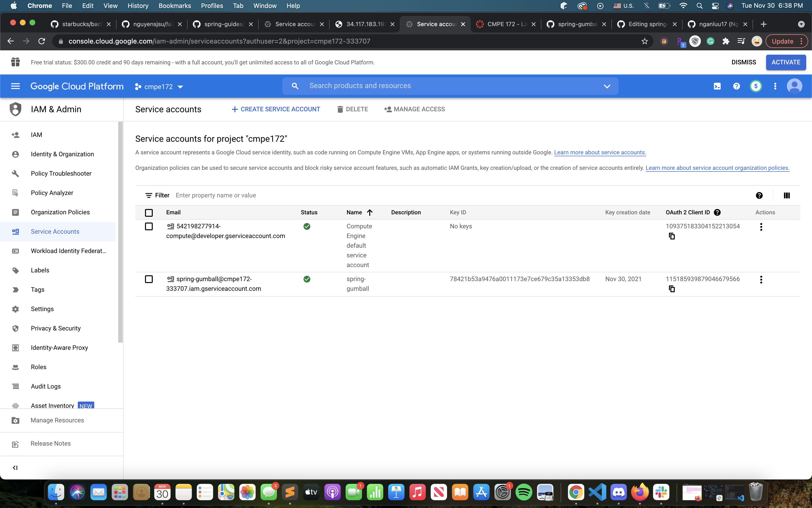

### GitHub Action Secrets
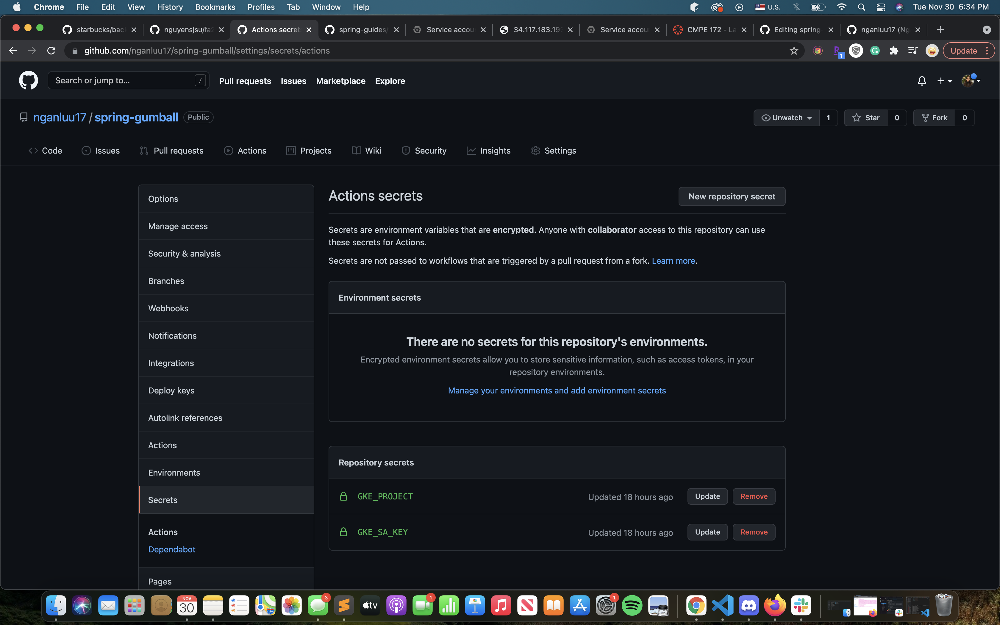

### Trigger a CD Deployment by creating a new GitHub Release
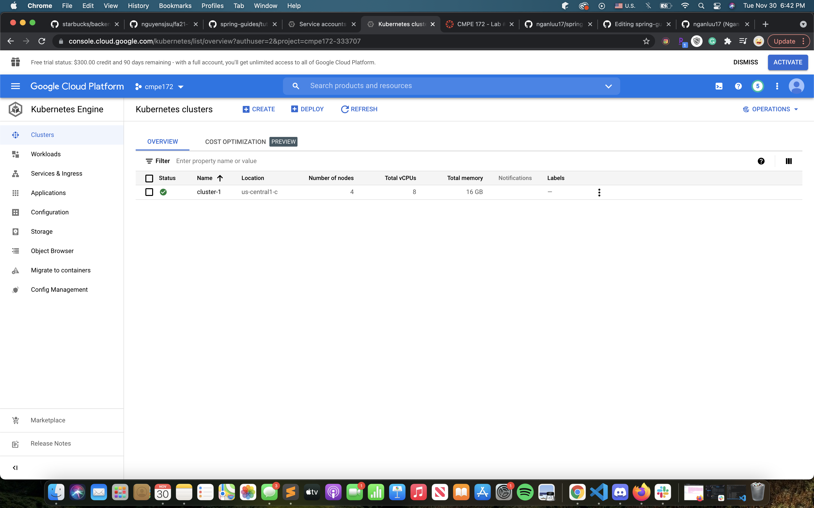
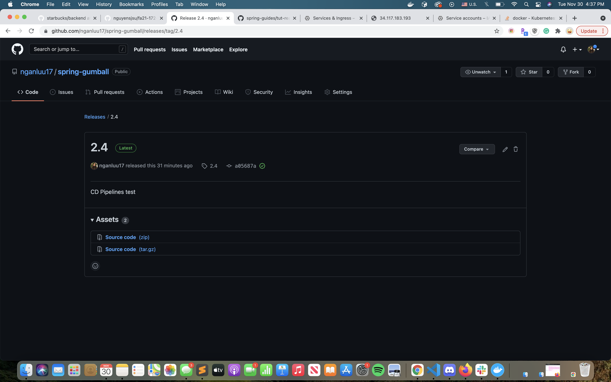
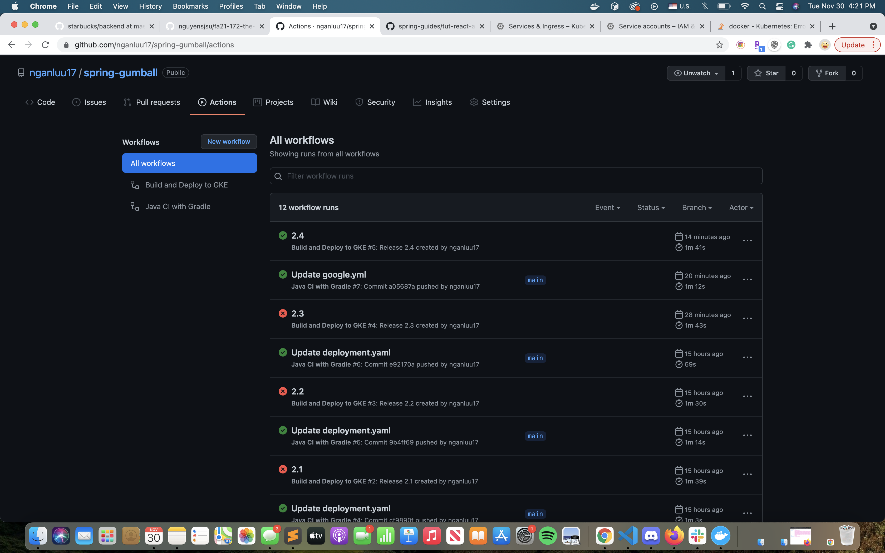
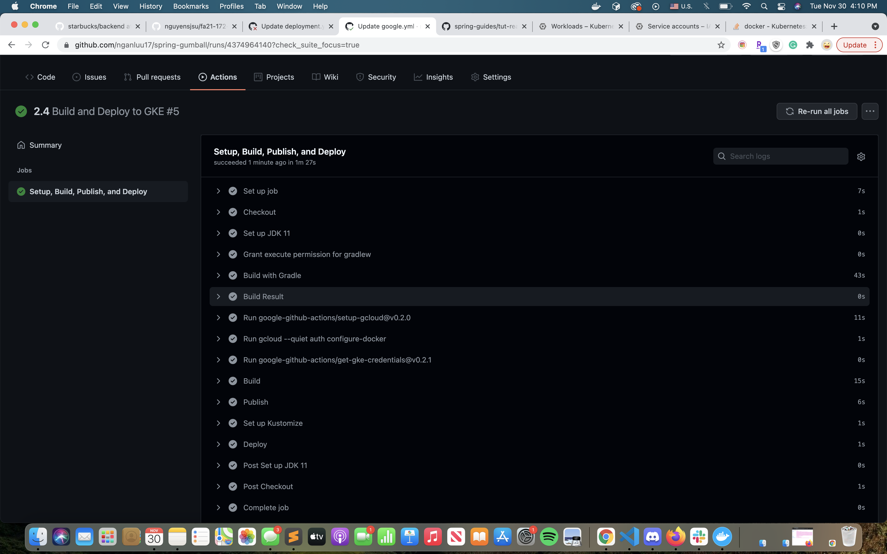
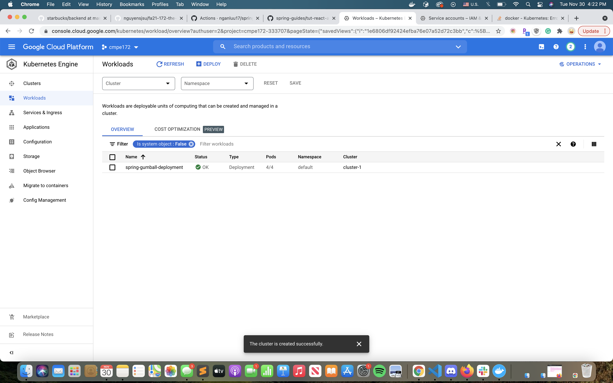
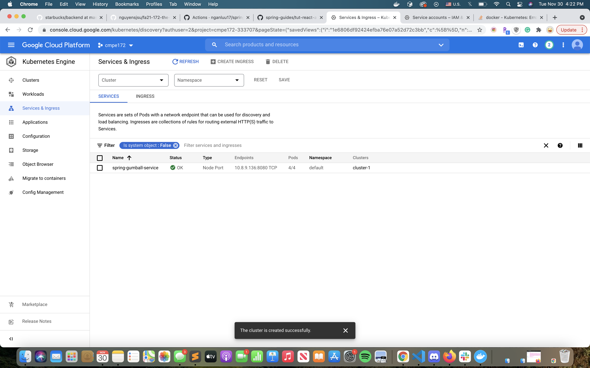
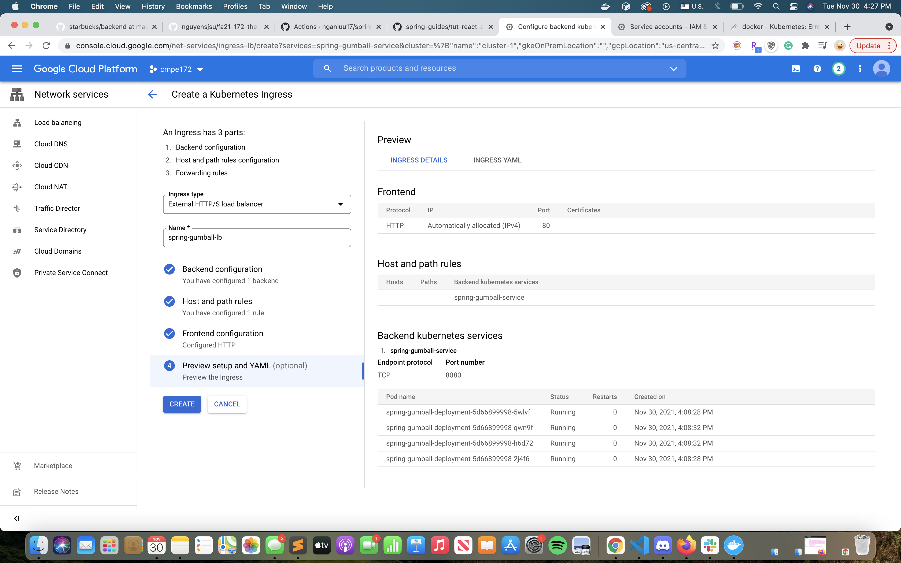
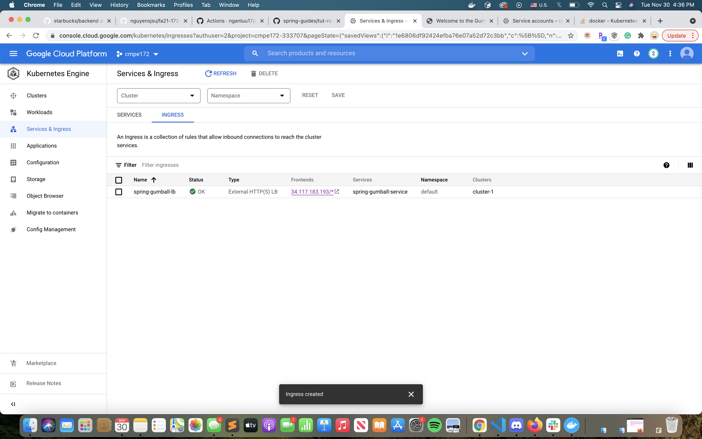
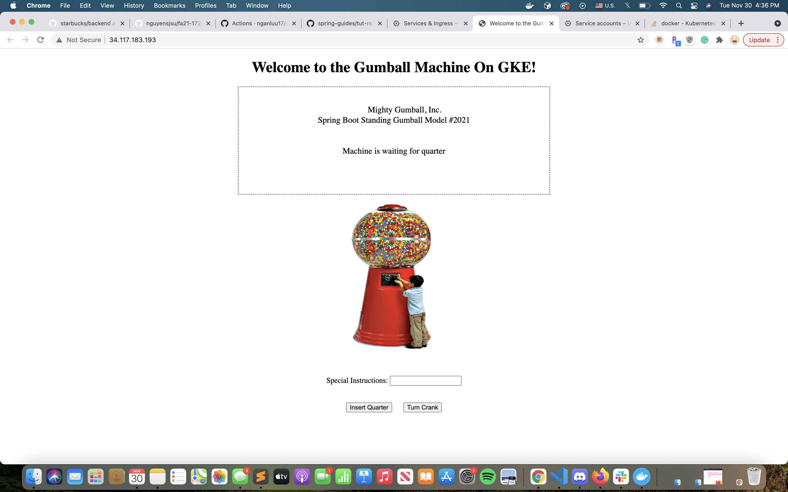
